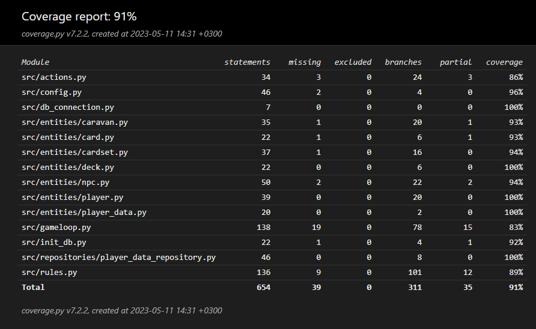

# Testausdokumentti

Ohjelman testaus tapahtuu käyttäen yksikkö- ja integraatiotestausta unittestilla.

## Yksikkö- ja integraatiotestaus

### Pelin säännöt ja toiminnot

Pelin säännöistä vastaavaa `rules`-moduulia testataan [TestRules](https://github.com/Wincewind/ot-harjoitustyo/blob/master/caravan/src/tests/rules_test.py)-testiluokalla. Pelin toiminnoista vastaavaa `actions`-moduulia taas testataan integraatiotestein mm. [TestNpc](https://github.com/Wincewind/ot-harjoitustyo/blob/master/caravan/src/tests/entities/npc_test.py)-testiluokalla.

Kummankin moduulin testauksessa alustetaan niiden tarvitsemat kaksi `Player`-oliota, jotka edustavat pelin pelaajaa ja tämän vastustajaa.

### PlayerDataRepository repositorio-luokka

Repositorio-luokkaa `PlayerDataRepository` testataan [TestPlayerDataRepository](https://github.com/Wincewind/ot-harjoitustyo/blob/master/caravan/src/tests/repositories/player_data_repository_test.py)-testiluokalla. Testeissä käytettävien sqlite db tiedostojen nimet on määritetty _.env.test_-tiedostossa.

### Entities-luokat

Pelin osien muodostavien olioiden luokkia: `Caravan`, `Card`, `CardSet`, `Deck`, `Player`, `PlayerData` ja `Npc` testataan [tests/entities](https://github.com/Wincewind/ot-harjoitustyo/tree/master/caravan/src/tests/entities)-hakemiston testiluokilla eri yksikkö- ja integraatiotestein.

### Gameloop-luokka

Pelinkulkua ja tähän liittyvää interaktiota käyttöliittymän kanssa, joka on implementoitu Gameloop-luokassa, testataan [TestGameloop](https://github.com/Wincewind/ot-harjoitustyo/blob/master/caravan/src/tests/gameloop_test.py)-testiluokalla. Testausta varten määritellään `StubEvent`, `StubEventQueue` ja `StubRenderer` -valeluokat, jotta testeissä voidaan gameloopille antaa ns. käyttäjän syötesarjoja pelin toimintojen testaamiseksi.

### Testauskattavuus

Pelin koodin testauskattavuus on 90%

### Asennus ja konfigurointi

Pelin lähdekoodin kloonaamista, julkaisujen lataamista ja riippuvaisuuksien/tiedostojen alustusta on testattu [käyttöohjeen](./dokumentaatio/kayttoohje.md) kuvaamalla tavalla Windows 11 sekä Linux-ympäristössä. Eri pygame ruudun resoluutioita ja tekoälyvastus asetusta on testattu muuttamalla konfiguraatioita _.env_-tiedostossa.
