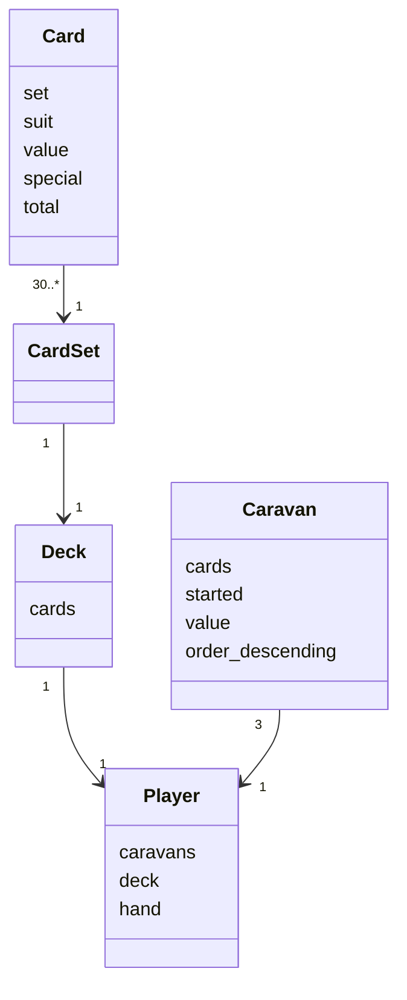
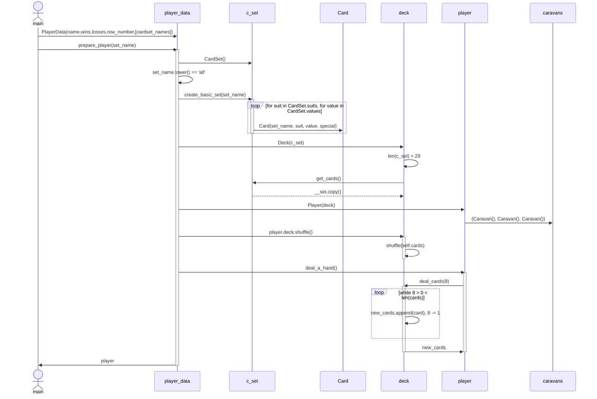

# Arkkitehtuurikuvaus

## Pelin logiikka

Pelin tietomallit muodostuvat luokat [Player](https://github.com/Wincewind/ot-harjoitustyo/blob/master/caravan/src/entities/player.py), [Caravan](https://github.com/Wincewind/ot-harjoitustyo/blob/master/caravan/src/entities/caravan.py), [Deck](https://github.com/Wincewind/ot-harjoitustyo/blob/master/caravan/src/entities/deck.py), [CardSet](https://github.com/Wincewind/ot-harjoitustyo/blob/master/caravan/src/entities/cardset.py) ja [Card](https://github.com/Wincewind/ot-harjoitustyo/blob/master/caravan/src/entities/card.py). Pelin alussa valituista korteista (CardSet), muodostetaan pelaajille pakat joita sitten kasataan pelaajan karavaaniin (Caravan). Suurin osa pelin logiikasta kohdistuu tähän mitä kortteja voidaan karavaaniin laittaa, ja miten se vaikuttaa kyseisen tai muitten karavaanien kortteihin/arvoon.

Pelin säännöt/toimintalogiikka löytyy [rules.py](https://github.com/Wincewind/ot-harjoitustyo/blob/master/caravan/src/rules.py)-tiedostosta. Tästä moduulista kutsutaan funktioita tarkistamaan onko pelaajan toiminto laillinen tai millainen vaikutus esim. erikoiskorteilla on. Näitä ovat esimerkiksi:
- `check_if_legal_move(player, opponent, move) -> tuple(bool,str)`
- `all_own_caravans_started_or_card_going_to_own_unstarted_caravan(player, move) -> bool`
- `putting_card_into_opponent_caravan(opponent, move) -> bool`
- `using_number_card(move) -> bool`
- `using_special_card(move) -> bool`
- `get_cards_removed_by_jack(move) -> list`
- `get_cards_removed_by_joker(player, opponent, move) -> list`
- `double_total_with_king(move) -> None`

## Pelin tietomallien alustus
Ennen kun peli voidaan aloittaa, täytyy kaksi pelaajaa luoda Player luokista ja nämä alustaa muilla luokilla. Oleellista on, ettei näitä luodessa käytetä viittauksia, esim. samaa deck oliota kummallakin pelaajalla, koska pelin mekaaniikkojen määrityksessä ja sääntöjen tarkistuksessa saatetaan hyödyntää viittauksia näihin olioihin.
Yhden pelaaja-olion alustaminen tapahtuu seuraavasti:

## Käyttöliittymä

Käyttöliittymä muodostuu tällä hetkellä kolmesta näkymästä:
1. Pelaaja datan valinta/luonti/poistaminen
2. Korttisarjan valinta (Card set) ja näistä pakan muodostaminen
3. Pelinäyttö

Näkymät on toteutettu omissa luokissaan ja niitä kutsutaan main-moduliista.
