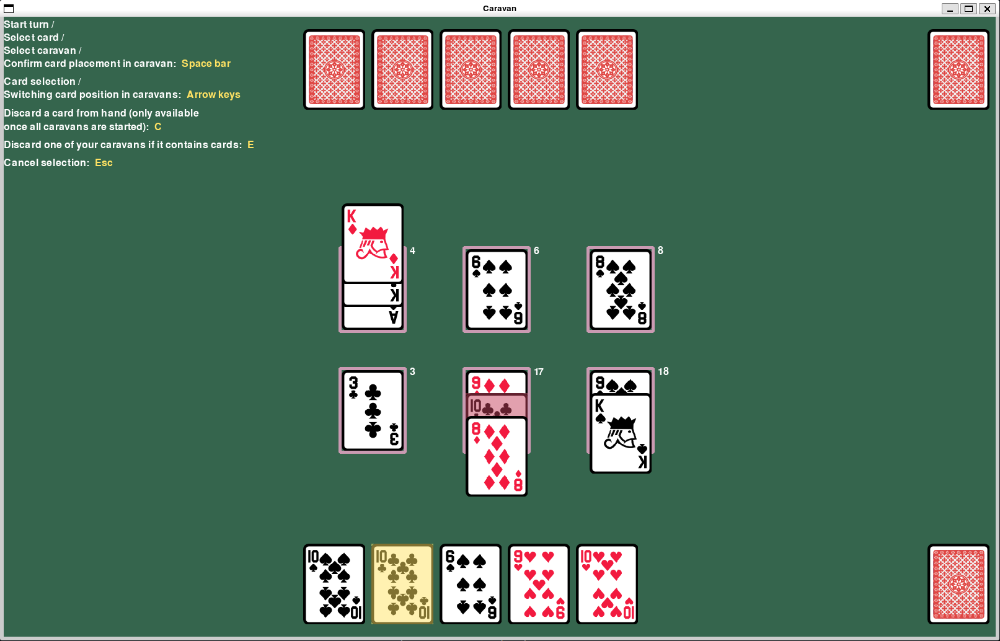

# Käyttöohje
Toimivan version takaamiseksi, voit ladata viimeisimmän julkaistun version [Realeases](https://github.com/Wincewind/ot-harjoitustyo/releases) osiosta, Assets alta.

## Konfigurointi
Pelaajan dataa säilötään .db tiedostossa, joka tallennetaan projekti-hakemiston [data](https://github.com/Wincewind/ot-harjoitustyo/tree/master/caravan/data)-kansioon. Tämän nimeä voidaan konfiguroida [.env](https://github.com/Wincewind/ot-harjoitustyo/blob/master/caravan/.env)-tiedostossa, sekä käyttöliittymän kokoa. Käyttöliittymän koon mittava muutos ei ole tällä hetkellä suositeltavaa, sillä kaikki elementit eivät skaalaannu sen mukana, pientä säätöä voi kuitenkin tehdä, jotta käyttöliittymä istuisi paremmin näytölle. Tekoälyvastuksen päälle ja pois kytkemiseen on myös asetus NPC_OPPONENT. Tähän asettamalla `True`, voi asetuksen ottaa käyttöön.

## Ohjelman alustus
Ennen ohjelman käynnistystä, täytyy riippuvaisuudet asentaa ja pelaaja datan säilömiseen tarkoitettu tietokanta muodostaa. Tämä tapahtuu siirtymällä caravan-hakemistoon ja ajamalla ensin komento:
```bash
poetry install
```
Tämän jälkeen alustetaan pelaaja datan db komennolla:
```bash
poetry run invoke build
```
**Huom!** Jos pelaaja datalle on jo aiemmin muodostettu db-tiedosto, tämä komento tulee nollaamaan sen sisällön, jos smaan niminen jo löytyy.

Nyt ohjelma voidaan käynnistää komennolla:
```bash
poetry run invoke start
```

## Pelaaja datan luominen/valinta/poistaminen
Kun ohjelma käynnistyy pitäisi näkyä seuraavanlainen näkymä:

Jos pelaaja dataa ei vielä ole olemassa, lukee tallennuspaikalla "Create a new save". Näistä klikkaamalla pääsee kirjoittamaan pelaaja datalle pelaajan nimen ja painamalla *Enter*, vahvistetaan syötetty nimi. Painamalla *Esc*, voidaan peruuttaa joko nimen syöttö, tai olemassa olevan pelaaja datan valinta.

Kun pelaaja data on luotu, lukee tallennuspaikalla pelaajan nimi ja voittojen sekä häviöiden määrä. Hiirellä klikkaamalla aktivoidaan tallennuspaikka ja ne voidaan joko valita käytettäväksi pelaaja datana pelissä klikkaamalla "Select", tai poistaa klikkaamalla "Delete".

**Huom Deleten valinnasta,** poistamista ei erikseen varmisteta vaan päätös on pysyvä heti Delete:ä klikkaamalla.

## Korttisarjan valinta
Kun pelaaja data on valittu avautuu seuraava näkymä, josta voidaan valita korttisarja:

Valinta tapahtuu hiirellä klikkaamalla jonka jälkeen peli alkaa. Valittua korttisarjaa käytetään pelaajan pakan muodostamisessa.

All-vaihtoehdolla pakka muodostetaan kaikista saatavilla olevista korttisarjoista.

Pelin lopullisessa versiossa tämä vaihe pelin valmistelusta koostuisi yksittäisten korttien valitsemisesta pakkaan jolloin käyttäjällä olisi täysi vapaus valita, millaisella pakalla hän pelaa, mutta tämä on toistaiseksi rajattu jatkokehityksen puolelle.

## Pelinäyttö, pelinkulku ja pelin tavoite
Korttisarjan jälkeen avautuu itse pelikenttä näkymä:

Vasemmassa yläkulmassa on pelin kontrolleihin ohjeet, mutta tässä vielä lyhyesti suomeksi:
- Vuoron aloitus (kun kummankin pelaajan korteista näkyy vain takapuolet), kortin valinta pelaajan kädestä, sijoituksen valinta jostain keskellä olevasta kuudesta karavaanista: *Välilyönti*
- Kädessä olevien korttien valinnan vaihto, kortin sijoituksen siirtäminen karavaaneissa ennen sen valintaa: *Nuolinäppäimet (vasen, oikea, ylös, alas)*
- Valinnan peruuttaminen: *Esc*
- Pelin lopettaminen, myös pelin päätyttyä, kun toinen pelaajista on voittanut: *Sulkemalla ikkuna oikean yläkulman ruksista*. **Huom!** jos peli on vielä kesken kun ikkuna suljetaan, lasketaan tämä pelaajan häviöksi.  

Peliä pelataan valitsemalla kädestä kortteja ja asettamalla niitä karavaniin. Kukin pelaaja voi vuorotellen valita kädestään yhden kortin. Peliin kuuluu myös toiminnot kortin asettamisen sijaan poistaa kädestä yksi kortti pois (kun kaikki karavaanit on aloitettu) tai heittää pois yksi omista karavaaneista. Näitä toimintoja ei ole vielä ehditty implementoida käyttöliittymään. Jos kortin asettaminen karavaaniin ei onnistu ja kortti on värjätty punaiseksi, tarkoittaa se että kyseinen sijoitus kortille ei ole sallittu. Kun sijoitus on sallittu, kortti värjääntyy vihreäksi.

Pelin tavoite on saada kaikki kolme omaa karavaania myytyä ennen vastustajaa. Karavaani on myyty, kun sen korttien arvo on yhteensä 21 ja 26 välillä (21 >= value <= 26), ja sen arvo on enenmmän kuin vastustajan vastakkainen karavaani, jos se on myös tällä välillä. Peli päättyy heti kun jompi kumpi pelaajista saa kaikki karavaaninsa valmiiksi eli tuolle 21-26 välille. Voittaja on se, jolla on enemmän myytyjä karavaaneja.

Peliin kuuluu vielä paljon tarkentavia sääntöjä, etenkin miten kuvakortit käyttäytyvät eri tilanteissa, joten [täällä](https://www.pagat.com/invented/caravan.html) voi niihin perehtyä tarkemmin.
