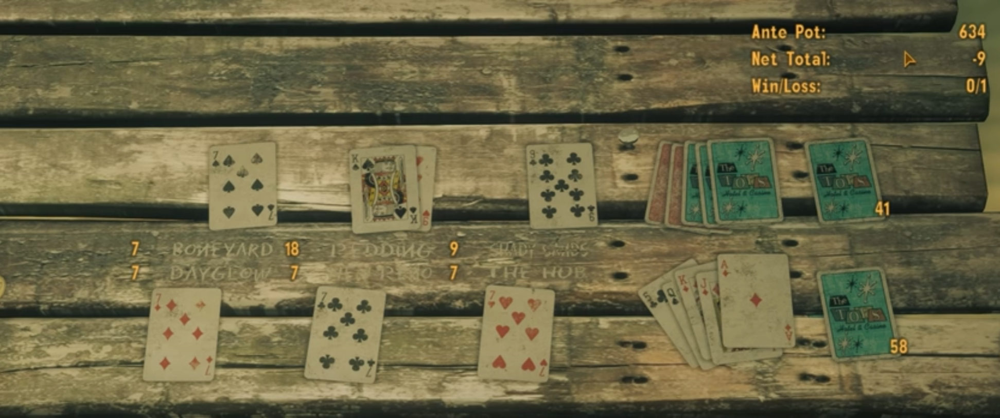
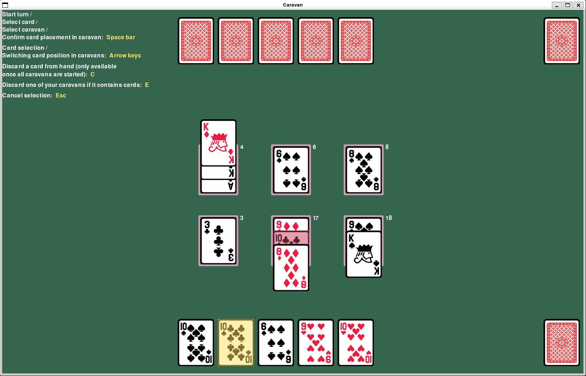

# Vaatimusmäärittely

## Caravan-pelin tarkoitus

Caravan on kahden pelaajan pelattava korttipeli, jota pelataan tavallisilla 52 korttipakan korteilla. Peli kehitettiin alunperin minipeliksi peliin nimeltä Fallout New Vegas ja sen englanninkieliset säännöt löytyvät [täältä.](https://fallout.fandom.com/wiki/Caravan_(game)#Background)

## Pelin käyttöliittymä

- [x] Peliin voi luoda käyttäjätiedot, joiden valinta ja luonti näkymä aukeaisi ensin. Tämän jälkeen valitaan/kootaan pakka ja valitaan pelin aloitus.
- [x] Alla kuvankaappaus Fallout New Vegas:in pelikentästä sekä omasta toteutetusta versiosta:

New Vegas             |  Oma pygame versio
:-------------------------:|:-------------------------:
  |  

- [x] Korttien ja muiden käyttöliittymäelementtien valintaa visualisoidaan väreillä. 

## Perusversion toiminnallisuuksia

### Käyttäjätiedot ja pelipakan valinta

- [x] Käyttäjätietojen valinta ikkunasta valitaan joko olemassa oleva nimi tai kirjoitetaan tekstikenttään uusi nimi ja valitaan "Create".
- [x] Pelipakaksi korttisarjan valinta.
  - [x] Mahdollisuus myös valita pakkaan kaikki saatavilla olevat korttisarjat.
- [x] Oletus-pakka vaihtoehto.

### Peli-moodit ja pelaajat

Kaksi peli-moodia, tekoälyvastus ja Hotseat kaksinpeli. Hotseat-versiossa aloittava pelaaja saa nähdä kädessään olevat kortit ensin ja toinen pelaaja sulkee silmänsä kunnes hänen vuoronsa tulee. Pelaajan pelattua jonkun kortin, vuoro vaihtuu hetken viiveellä, jolloin toinen pelaaja saa avata silmänsä ja vuoronsa päättänyt sulkee omansa.
- [x] Hotseat versio pelistä
- [x] Yksinkertainen tekoälyvastus

## Jatkokehitysideoita

Loppupalautuksen jälkeen peliä voidaan vielä täydentää esim. seuraavilla toiminnallisuuksilla:

- Korttipakan kasaaminen.
  - Tätä en ehtinyt kehittää loppupalautus-versioon, mutta se on mielestäni edelleen hyvin oleellinen osa alkuperäistä peliä.
- Korttien keräily/ostamis mekaniikka ja ehkä tätä varten rahan voittaminen/häviäminen.
- Interaktiivisempi korttien käsittely, esim. "drag and drop" toiminnallisuus. 
- Monimutkaisempi "Tekoäly" vastustaja.
  - Valittavana helppo/keskiverto/vaikea vaikeusasteet.
- Sääntöjen muokkaaminen ["Meta"-taktikoinnin](https://fallout.fandom.com/wiki/Caravan_(game)#cite_note-1) tehokkuuden vähentämiseksi.
