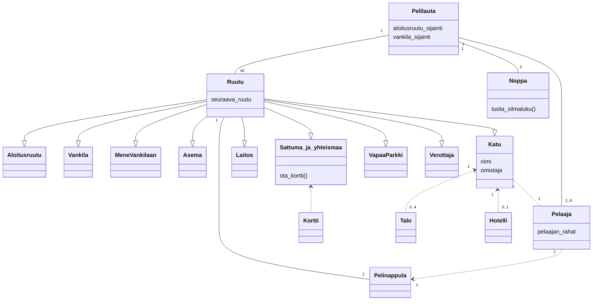

## Monopolin rakenne

```mermaid
 classDiagram
      Ruutu --|> Aloitusruutu
      Ruutu --|> Vankila
      Ruutu --|> MeneVankilaan
      Ruutu --|> Asema
      Ruutu --|> Sattuma_ja_yhteismaa
      Ruutu --|> Laitos
      Ruutu --|> Katu
      Ruutu --|> VapaaParkki
      Ruutu --|> Verottaja
      Pelilauta "1" -- "40" Ruutu
      Pelilauta "1" -- "2" Noppa
      Pelaaja "1" ..> "1" Pelinappula
      Ruutu "1" -- "1" Pelinappula
      Pelilauta "1" -- "2..8" Pelaaja
      Sattuma_ja_yhteismaa <.. Kortti
      Katu "1" <.. "0..4" Talo
      Katu "1" <.. "0..1" Hotelli
      Katu "*" .. "1" Pelaaja
      
      class Pelilauta{
       aloitusruutu_sijainti
       vankila_sijainti
      }
      
      class Aloitusruutu      
      class Vankila
      class Sattuma_ja_yhteismaa{
       ota_kortti()
      }
      class MeneVankilaan
      class Asema
      class Laitos
      class Katu{
       nimi
       omistaja
      }
      class Verottaja
      class VapaaParkki
      
      class Pelaaja{
        pelaajan_rahat
      }
      
      class Pelinappula
      
      class Noppa{
        tuota_silmaluku()
      }
      
      class Ruutu{
        seuraava_ruutu
      }
      
      class Kortti
      class Talo
      class Hotelli
```
