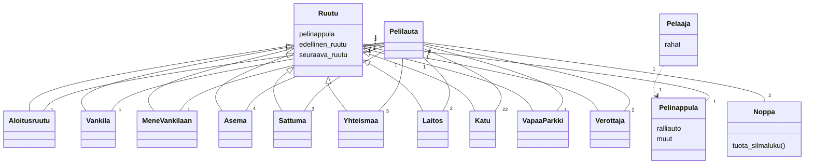

## Monopolin rakenne

```mermaid
 classDiagram
      Ruutu <|-- Aloitusruutu
      Ruutu <|-- Vankila
      Ruutu <|-- MeneVankilaan
      Ruutu <|-- Asema
      Ruutu <|-- Sattuma
      Ruutu <|-- Yhteismaa
      Ruutu <|-- Laitos
      Ruutu <|-- Katu
      Ruutu <|-- VapaaParkki
      Ruutu <|-- Verottaja
      Pelilauta "1" -- "1" Aloitusruutu
      Pelilauta "1" -- "1" Vankila
      Pelilauta "1" -- "1" MeneVankilaan
      Pelilauta "1" -- "1" VapaaParkki
      Pelilauta "1" -- "3" Sattuma
      Pelilauta "1" -- "3" Yhteismaa
      Pelilauta "1" -- "4" Asema
      Pelilauta "1" -- "2" Noppa
      Pelilauta "1" -- "2" Laitos
      Pelilauta "1" -- "2" Verottaja
      Pelilauta "1" -- "22" Katu
      Pelaaja "1" ..> "1" Pelinappula
      Ruutu "1" -- "1" Pelinappula
      
      
      class Pelilauta{
      }
      
      class Aloitusruutu      
      class Vankila
      class Sattuma
      class Yhteismaa
      class MeneVankilaan
      class Asema
      class Laitos
      class Katu
      class Verottaja
      class VapaaParkki
      
      class Pelaaja{
        rahat
      }
      
      class Pelinappula{
        ralliauto
        muut
      }
      
      class Noppa{
        tuota_silmaluku()
      }
      
      class Ruutu{
        pelinappula
        edellinen_ruutu
        seuraava_ruutu
      }
      
```
