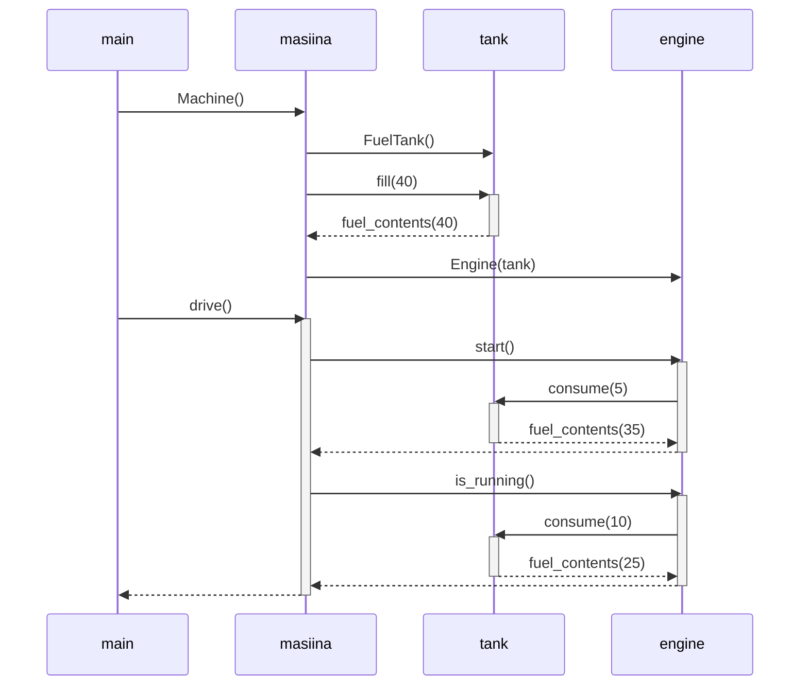

```mermaid

sequenceDiagram
    main->>masiina: Machine()
    masiina->>tank: FuelTank()
    masiina->>+tank: fill(40)
    tank-->>-masiina: fuel_contents(40)
    masiina->>engine: Engine(tank)
    main->>masiina: drive()
    activate masiina
    masiina->>engine: start()
    activate engine
    engine->>tank: consume(5)
    activate tank
    tank-->>engine: fuel_contents(35)
    deactivate tank
    engine-->>masiina: 
    deactivate engine
    masiina->>engine: is_running()
    activate engine
    engine->>tank: consume(10)
    activate tank
    tank-->>engine: fuel_contents(25)
    deactivate tank
    engine-->>masiina: 
    deactivate engine
    masiina-->>main: 
    deactivate masiina
    
```
